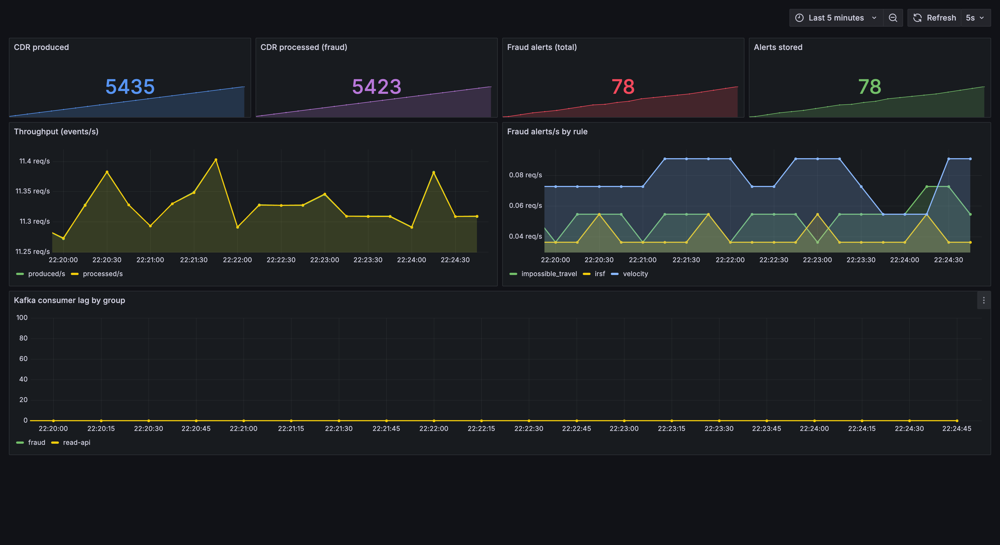

# go-cdr-fraud-detector

*English · [Türkçe](README.tr.md)*

Real-time **telecom fraud detection** over a stream of Call Detail Records
(CDRs), written in Go. An event-driven pipeline ingests calls from Kafka and runs
three independent fraud rules over them — flagging suspicious activity within
milliseconds — behind clean, separately-deployable microservices.

> Telcos usually detect fraud with expensive, closed-box enterprise systems.
> This project is an open, Go-native take on the core of that problem:
> catch fraud in live CDR traffic, cleanly and observably.

## Live demo — try the decision engine in your browser

**[ahaygun.github.io/go-cdr-fraud-detector](https://ahaygun.github.io/go-cdr-fraud-detector/)** — the three fraud rules, compiled to **WebAssembly** and running live over synthetic calls you can generate and inject. Move the thresholds and watch fraud get flagged in real time.

It runs the **real rule code** (`internal/rules`) unchanged; only the per-subscriber state store (Redis in the pipeline) is swapped for in-memory maps, and enrichment is served from the local catalogs. So it is a demo of the **decision engine**, not the distributed system — there is no Kafka, Redis or microservices in the browser. The full event-driven pipeline is what the rest of this README describes.

## Features

- **Event-driven pipeline** — a generator produces CDRs onto Kafka; independent
  consumers process them. Producers and consumers are decoupled, so the fraud
  service scales and fails on its own.
- **Three fraud rules, three techniques** — not three threshold checks:
  **velocity** (stream windowing), **impossible-travel** (stateful last-known
  location), and **IRSF** (enrichment + a spend window). Each targets a real,
  distinct fraud type.
- **Synchronous gRPC enrichment** — the fraud service enriches each record via a
  gRPC reference service (cell → geo, destination tariff) and **degrades
  gracefully** if that service is down: the other rules and the pipeline keep
  running.
- **Correct under redelivery** — partition-by-subscriber, manual offset commit
  and `record_id` idempotency turn at-least-once delivery into *effectively*
  once. One alert per subscriber per window, not one per offending call.
- **Observable** — Prometheus metrics and a provisioned Grafana dashboard
  (throughput, alerts by rule, consumer lag).
- **Kubernetes-native scaling** — a Helm chart deploys the whole stack; **KEDA**
  autoscales the fraud consumer on Kafka lag (1 → 3 replicas).
- **Measured** — ~890 events/s per replica at p99 ~25 ms; the numbers are
  reproducible (see [Performance](#performance)).

## Architecture

```
 generator ──▶ Kafka ─────▶ fraud ─────▶ Kafka ─────▶ read-api ──▶ HTTP /alerts
 (synthetic    (cdr.raw,    │ 3 rules     (cdr.fraud   (Postgres,
  CDRs +        msisdn-     │ + Redis      .alert)      idempotent)
  fraud         keyed,      │ state)
  scenarios)    3 parts)    │
                            └─ gRPC ─▶ subscriber-service (cell→geo · tariff)
```

**Async where it fits, sync where it fits:** the event stream flows over Kafka;
per-record enrichment is a synchronous gRPC call. Two communication models, each
in its right place.

| Service | Role |
|---|---|
| **generator** | Emits synthetic CDRs + injects fraud scenarios (velocity bursts, impossible-travel jumps, IRSF spikes) |
| **fraud** | Consumes `cdr.raw`; runs the three rules over Redis state; emits alerts on `cdr.fraud.alert` |
| **subscriber-service** | gRPC reference data — cell → geo (`GetCell`) and destination tariff (`GetTariff`) |
| **read-api** | Stores alerts in Postgres (idempotently); serves `GET /alerts` and `/healthz` |

Infrastructure: **Kafka (KRaft)** · **Postgres** · **Redis**.

## The fraud rules

Each rule catches a different real fraud type, so each needs a different
technique — that is the point, not three variations of a threshold.

| Rule | Fraud it catches | Technique |
|---|---|---|
| **Velocity** | SIM-box / high-volume abuse | Redis sliding-window count per subscriber |
| **Impossible-travel** | cloned SIM / account takeover | last-known cell (Redis) + Haversine distance vs. elapsed time |
| **IRSF** | International Revenue Share Fraud | premium-destination spend accrued in a window (tariff fetched via gRPC) |

The generator injects each scenario on a timer, so a fresh run flags all three
within a minute.

## Run it

Requires Docker + Docker Compose.

```bash
make up                        # the whole core, one command
curl -s localhost:8090/alerts  # flagged calls (JSON)
make logs                      # watch fraud catch the injected scenarios
make down
```

Within ~15 seconds the generator injects its first fraud scenario, the fraud
service flags it, and the alert appears on `read-api`.

## Design decisions

- **Partition by subscriber** — events are keyed by `caller_msisdn`, so all of a
  subscriber's calls land on one partition and one consumer. Stateful rules stay
  consistent, ordering is preserved, and the fraud service scales out (up to the
  partition count) without splitting a subscriber's state.
- **Effectively-once** — Kafka gives at-least-once; the fraud consumer commits
  offsets manually (only after processing), dedups on `record_id`, and uses
  `record_id` as the sliding-window member so a redelivered record cannot inflate
  a count. Alerts are stored with `ON CONFLICT DO NOTHING`.
- **Emit before advancing state** — an alert is emitted *before* a rule's Redis
  state moves forward, so a failed emit can be retried instead of lost. Alerts
  are de-duplicated per `(rule, subscriber)` per window, so a burst yields one
  alert, not a flood.
- **gRPC for enrichment, graceful degradation** — impossible-travel and IRSF
  need reference data (cell geo, tariff), fetched synchronously over gRPC with a
  timeout. If `subscriber-service` is down, those rules are skipped while
  velocity and the pipeline carry on.
- **Async vs sync, on purpose** — Kafka decouples the high-volume event flow;
  gRPC serves the synchronous per-record lookup. The split is deliberate — the
  kind of decision a reviewer should be able to interrogate.

## Observability

```bash
make up-observability   # adds Prometheus + Grafana + kafka-exporter
# Grafana: http://localhost:3001  (anonymous, no login)
```

Each service exposes Prometheus metrics on `:9100`; a provisioned Grafana
dashboard shows throughput, fraud alerts per rule, and Kafka consumer lag live:



## Kubernetes + autoscaling

```bash
make k8s-up      # kind cluster + KEDA + the Helm chart
make k8s-load    # generate lag → KEDA scales fraud 1 → 3
kubectl get hpa -w
make k8s-down
```

The Helm chart (`deploy/helm/cdr`) deploys the whole stack with health probes. A
**KEDA `ScaledObject`** autoscales the fraud deployment on `cdr.raw` consumer lag
(min 1, max 3 = partition count); because events are keyed by subscriber, the
scaled-out replicas keep per-subscriber state consistent. Captured evidence:
[`docs/k8s-autoscaling.txt`](docs/k8s-autoscaling.txt).

> ⚠️ A local kind cluster — this demonstrates *deploying to Kubernetes with Helm
> and KEDA lag-autoscaling*, not production Kubernetes operations.

## Performance

Measured on Docker Compose, one machine (Apple Silicon, Docker ~11 CPU / 8 GB),
a single `fraud` replica — reproducible with `make loadtest` and
`k6 run loadtest/read-api.js`:

| Metric | Result |
|---|---|
| Pipeline throughput (fraud, saturated) | **~890 events/s** |
| Pipeline latency at 300 events/s (produce → processed) | p50 ~6 ms · **p99 ~25 ms** |
| read-api HTTP (`GET /alerts`, 50 VUs, k6) | **~12,000 req/s** · p95 ~7 ms · 0% errors |

Throughput per replica is bounded by the fraud service's two synchronous gRPC
enrichment calls + Redis ops per record — the producer alone sustains ~533k/s,
so it is the *processing* that costs, not the ingest. That is exactly what KEDA
addresses: under load, fraud scales 1 → 3 for roughly triple the capacity.

> ⚠️ Single-machine, local numbers — not a distributed benchmark; the machine and
> commands are stated so you can reproduce them.

## Testing & CI

```bash
make test   # unit tests — the fraud rules are pure and table-driven
make lint   # gofmt + vet
```

GitHub Actions runs gofmt, build, vet and the tests on every push.

## Layout

```
cmd/loadgen         async Kafka load generator (throughput/latency tests)
cmd/playground      the fraud rules compiled to WebAssembly (the in-browser demo)
internal/cdr        event schema (CDR, FraudAlert)
internal/stream     Kafka helpers (keyed producer, manual-commit consumer)
internal/rules      the three fraud rules (pure, table-tested)
internal/geo        cell → geo catalog + Haversine
internal/tariff     destination tariff catalog
internal/platform   logging, config, metrics/health server, graceful shutdown
services/           generator · fraud · subscriber · read-api
proto/              gRPC contract (subscriber Reference service)
deploy/             Dockerfile, docker-compose, Helm chart, observability
loadtest/           k6 script
web/                the in-browser demo page (design shell + wasm loader)
docs/               built demo for GitHub Pages (make wasm) + evidence assets
```

## License

[MIT](LICENSE) © Ahmet Hasan Aygün
